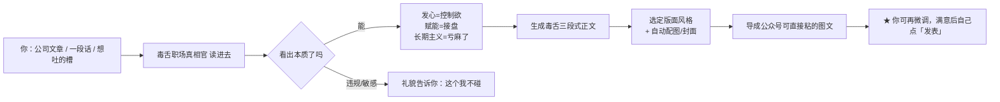
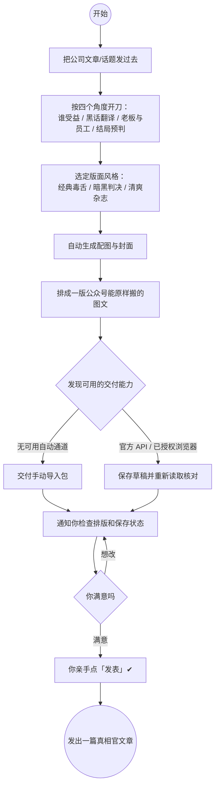

# Workplace Truth Teller

[](https://github.com/yinnxinn/truth-teller/actions/workflows/validate-skill.yml)

中文名：**毒舌职场真相官**。

这是一个面向中文职场内容的通用 AI Skill 与微信公众号创作工作区：把公司新闻稿、内部信、财报、职场复盘和流量科普拆成可核实的事实与有边界的评论，再生成适合审阅和微信编辑器使用的内容。支持不同 AI 宿主按统一协议交付草稿，不绑定 Codex、操作系统或浏览器品牌。

---

## 给非技术读者的 30 秒说明书（先看这个）

> 一句话：**专治「领导一开口就开始说听不懂的话」**。
> 这篇项目是一支「毒舌职场真相官」：你喂给它一篇公关稿、一封内部信、一份财报致辞，
> 它用二十年资深评论员的毒舌，帮你看穿里面的「战略叙事」和「深度复盘」，
> 再把分析排成一篇能直接搬进公众号后台的图文。

把它当成一个**免费的公众号小编 + 毒舌写手**来理解就好：

- 你手头有一篇「看着像在画饼」的公司文章？丢给它。
- 你想表达「这领导又在用听不懂的词布置任务」却说不利索？丢给它。
- 你想要一篇有观点、能发公众号、还带排版的稿子？丢给它，它从头到尾做完。

**让一个普通人上手的步骤只有三步：**

1. **手头有一篇想解构的公司文章 / 一段话 / 一个想吐的槽**；
2. **把它喂给这个 Skill 跑一遍**（你说一句大白话指令即可，不用写代码）；
3. **收到图文草稿后，去公众号后台自己点「发表」**。

实际能力取决于 AI 平台提供的工具：有官方 API 或已授权浏览器时尝试自动保存；两者都不可用时交付手动导入包。HTML 生成器与可选离线通道选择器需要 Python。



**从一篇素材到发进公众号，一条龙大致长这样（中途不用你写代码）：**



> 💡 有两个「按钮」始终握在**你自己**手里：用不用某句吐槽由你定；
> 最关键的是——**「发表」由你手动点**。自动保存只有在回读核验后才算成功；手动导入包不等于已进草稿箱。

**一篇成品大概长这样（很有辨识度的组合）：**

| 段落 | 大概内容 |
|---|---|
| 🎯 真相翻译官 | 一句话戳穿原文真正在说啥（通常跟作者本意正好相反） |
| 🔪 毒舌深拆解 ×N | 摘它原话 + 一句到位吐槽，逐条拆 |
| ⚖️ 最后的判词 | 给这个项目/公司一句不留情面的讽刺结语 |
| 🧠 认真脸提示 | 遇到健康/法律这类专业题材，正经提醒，不乱抖机灵 |

看着刺、讲理；**不拿外貌、性别、地域或隐私攻击具体个人**。
你**不被允许**用本技能产出违法、色情、政治敏感内容，也不点“发表”。

下面的分节（能做什么 / 怎么装 / 怎么用 / 微信安全版 / 实验自动化 / 项目结构 / 参与贡献 / 许可证）面向想了解能力与细节的人，按照惯例逐字写清楚。

## 能做什么

| 能力 | 稳定性 | 说明 |
|---|---|---|
| 素材核实与文章生成 | 稳定核心 | 解构权力、责任、成本和激励关系；不捏造原文。 |
| 微信安全版 HTML | 稳定核心 | 必须由 `skill/scripts/gen_wechat_safe.py` 实际生成。 |
| 配图生成与降级 | 稳定核心 | 有可用生图工具时生成插画；失败时允许无图或占位方案。 |
| 公众号后台保存草稿 | 实验自动化 | 官方 API → 已授权浏览器 → 手动导入包；由当前平台可用工具执行并回读验证。 |
| 自动发表 | 不支持 | 项目不自动点击“发表”；最终发布始终由用户确认。 |

一句话边界：**内容生成是产品，后台自动化是实验。**

项目不自动发布任何文章；保存草稿和正式发表是两个不同权限层级。

## 两种使用方式

### 1. 全局安装同一套 Skill（推荐）

Skill 的稳定调用名保持为：

```text
$toxic-corporate-truth-teller
```

仓库中的 `skill/` 是唯一维护源。本机各工具目录只是部署副本，不应单独修改；更新仓库后统一运行同步器，避免 Codex 能用新版、WorkBuddy 却还在读旧规则。

先克隆仓库：

```powershell
git clone https://github.com/yinnxinn/truth-teller.git
cd truth-teller
```

先预览目标，再安装并核对：

```bash
python tools/sync_skill.py --all --dry-run
python tools/sync_skill.py --all
python tools/sync_skill.py --check
```

`--all` 只选择当前用户目录下已经存在的宿主 Skill 根目录，不会凭空配置未安装的软件：

| 宿主 | 默认 Skill 根目录 |
| --- | --- |
| Codex | `~/.codex/skills` |
| Cursor | `~/.cursor/skills` |
| Gemini | `~/.gemini/skills` |
| WorkBuddy | `~/.workbuddy/skills` |
| WorkBuddy AI | `~/.workbuddy-ai/skills` |

每个根目录下的实际安装名都是 `toxic-corporate-truth-teller`。更新已有版本前，同步器会把旧副本完整备份到 `~/.truth-teller-skill-backups/<宿主>/<时间戳>/`；内容已经一致时不写入也不产生备份。`--check` 只比较文件清单和 SHA256，不修改文件。

例如 Codex 的完整安装位置是 `~/.codex/skills/toxic-corporate-truth-teller`；其他宿主同样在上表根目录下使用这一固定名称。

其他支持 Agent Skills 的平台可以显式指定一个或多个 Skill 根目录：

```bash
python tools/sync_skill.py --target /path/to/tool/skills
python tools/sync_skill.py --target /path/to/first/skills --target /path/to/second/skills
```

Gemini 或其他宿主的根目录不存在时，先按该工具文档启用 Skills，再用 `--target` 安装。同步器不会复制凭据、环境变量、公众号回执、缓存或本地配置，也不调用微信接口。不同宿主使用同一套 Skill，只代表指令和脚本一致；浏览器、网络与账号权限仍由各宿主分别提供。安装或更新后请开启新会话，让工具重新发现 Skill。

日常更新固定为：`git pull` → 运行测试 → `python tools/sync_skill.py --all` → `python tools/sync_skill.py --check`。如需回滚，从命令输出所示的 `.truth-teller-skill-backups` 目录恢复对应宿主副本。

### 2. 使用完整工作区

仓库根目录的 `app/` 保留了文章批量生成、HTML 校验和公众号草稿实验脚本。它们适合继续开发和调试，不属于跨环境保证可用的 Skill 核心。

```powershell
python -m pip install -r requirements.txt
python app\run_pipeline.py --check
python app\run_pipeline.py --list
```

涉及公众号后台的脚本可能需要 Windows、已登录的 Chrome、CDP `9222` 端口及当前页面结构。运行前请阅读脚本和[维护说明](docs/skill-maintenance.md)，不要把浏览器配置或登录数据提交到仓库。

## 快速开始

在 Codex 中调用：

```text
$toxic-corporate-truth-teller 解构这份内部通知，保留事实边界，并生成供我审阅的公众号文章与微信安全版 HTML。
```

也可以让 Skill 搜索近期热点，但涉及新闻、政策、医学、法律或财务事实时必须核实来源。文章至少包含：

- 真相翻译官：一句话指出包装后的真实激励。
- 毒舌深拆解：逐条引用原文，再评论组织逻辑。
- 最后的判词：给出讽刺但不人身攻击的结论。
- 原文来源、版权说明；专业题材增加认真提醒。

完整行为说明见 [`skill/SKILL.md`](skill/SKILL.md)，原创示例见 [`skill/examples/README.md`](skill/examples/README.md)。

## 生成微信版 HTML

准备 `article.json` 后，在仓库根目录运行：

```powershell
python skill/scripts/gen_wechat_safe.py --config article.json --out article.html --no-images
```

安全版生成器默认采用更稳妥的内联结构。脚本无法运行时，不要把模型手写的 HTML 称为“微信安全版 HTML”。生成后先在本地打开检查，再复制粘贴到公众号编辑器。

三种内容风格：

- `classic`：通用内部信、职场材料。
- `dark`：重磅组织问题和强冲突话题。
- `magazine`：轻量吐槽、生活方式或科普。

`skill/assets/article_template.html` 为旧版兼容参考，不用于默认安全输出。

## 实验自动化：保存公众号草稿

这是依赖宿主执行能力的实验功能，不保证每个平台都具备自动保存条件。

直接说：“生成文章并保存到我的公众号草稿箱。”Skill 沿用已确认的目标账号和授权，按以下顺序选择能执行的通道：

1. **官方 API**：使用内置标准库客户端、宿主已有连接器或服务端客户端，上传素材、创建草稿、回读核对。
2. **已授权浏览器**：没有可用 API 时使用平台提供的浏览器能力；确认登录账号，填写并保存，再重新打开核对。
3. **手动导入包**：自动通道均不可用时，整理文章、HTML、图片、导入说明和结果清单，明确标注尚未保存。

API 缺配置但浏览器已就绪时直接用浏览器，不强制先配置 API。配置默认可省略；工具和权限由宿主实际探测，不能靠配置声明获得。

需要指定账号或顺序时，将[配置示例](skill/assets/delivery.example.json)另存为 Skill 目录外的 `delivery.local.json`。最小配置例如：

```json
{
  "schema_version": 1,
  "account": {"alias": "my-wechat"},
  "delivery": {"order": ["official_api", "browser", "manual"]}
}
```

显式配置文件优先，其次 `TRUTH_TELLER_CONFIG` 指定的文件，否则使用默认值。凭据只配置环境变量名称或使用宿主安全存储，不写入 JSON；浏览器默认 `auto`，不固定端口、Profile 或系统路径。

有 Python 3.10+ 时，可在仓库根目录检查离线决策：

```bash
python skill/scripts/delivery_plan.py --config delivery.local.json
```

未提供观察快照时返回 `probe_required`；这个计划命令不联网、不保存草稿。真实 API 保存使用：

```bash
python skill/scripts/wechat_api_delivery.py \
  --article article.json \
  --html wechat-safe.html \
  --cover cover.jpg \
  --result api-delivery-result.json
```

客户端从 `WECHAT_APP_ID`、`WECHAT_APP_SECRET` 读取凭据，上传封面、创建草稿并回读；不发布、不打印令牌、不自动重试创建。当前直接执行模式只支持无正文图片的文章，检测到任何 `` 会在联网前停止；有正文图片时改用能完成素材上传和 URL 重写的宿主连接器。无 Python 时仍可由宿主按协议执行，但不能运行本项目脚本。

请为每篇文章保留固定的 `--result` 路径。它同时是防重复台账：已验证结果会直接复用，状态不明或已有草稿标识时拒绝盲目重建，不同账号或内容也不能覆盖该回执。内容身份按规范化正文、封面哈希和 AppID 指纹计算，因此仅调整 JSON 排版或换行不会绕过去重。

保存响应不明时先核查原尝试，不换通道重复创建。必须有草稿标识及账号、标题、正文、图片的回读证据才计为成功；明确的安全拒绝不触发绕过式降级。完整约定、快照字段及恢复流程见[交付协议 v1](skill/references/draft_delivery.md)。

## 项目结构

```text
skill/       可独立安装的 Codex Skill、模板、生成器、参考资料和测试
app/         公众号内容与草稿实验自动化脚本
content/     可复现流程使用的源材料；生成草稿默认不入库
assets/      工作区配图资源
docs/        设计、迁移、维护和历史实施计划
tests/       仓库级开源布局测试
```

## 本地验证

需要 Git、Python 3.12、Node.js 22、`pytest` 和 `PyYAML`：

```powershell
python -m pip install pytest pyyaml
python -m pytest skill/tests tests -v
$env:PYTHONUTF8 = "1"
python "$env:USERPROFILE\.codex\skills\.system\skill-creator\scripts\quick_validate.py" skill
git diff --check
```

`quick_validate.py` 来自 Codex 内置 `skill-creator`；没有该工具时，至少运行 pytest 和 `git diff --check`。

## 安全与内容边界

- 不提交 API 密钥、Cookie、浏览器会话、登录截图、公众号账号数据和用户私人草稿。
- 事实性评论必须保留来源；不能读取原文时要求用户粘贴，不靠猜测补齐。
- 讽刺落点是组织结构和权力逻辑，不攻击真实个人的外貌、性别、地域或隐私。
- 医学、法律、财务等高风险内容必须核实，并明确不是专业意见。
- 所有外部发布动作都需要用户最终确认。

## 参与贡献

请阅读 [`CONTRIBUTING.md`](CONTRIBUTING.md)。修改 Skill 时需要提供行为基线、测试结果和变更后的前向验证；修改公众号自动化时不得提交登录态或真实账号数据。

## 许可证

本项目使用 [MIT License](LICENSE)。第三方素材、文章原文和平台内容仍受各自版权与服务条款约束。
